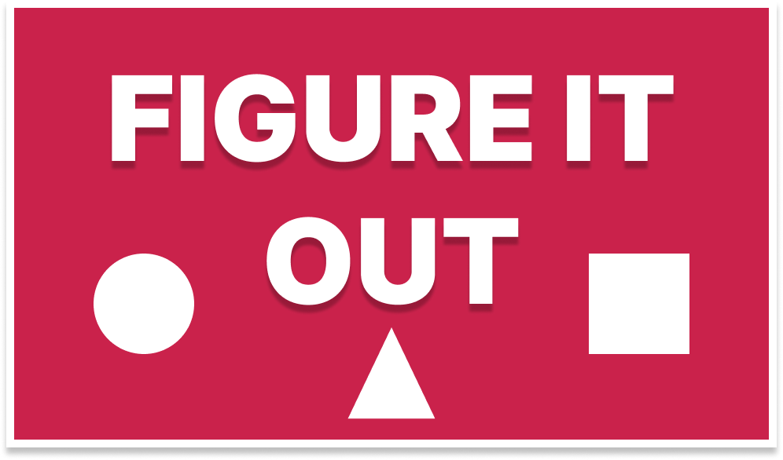
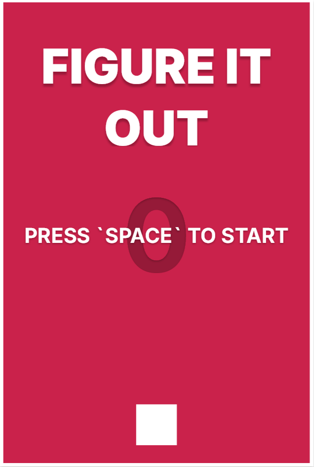
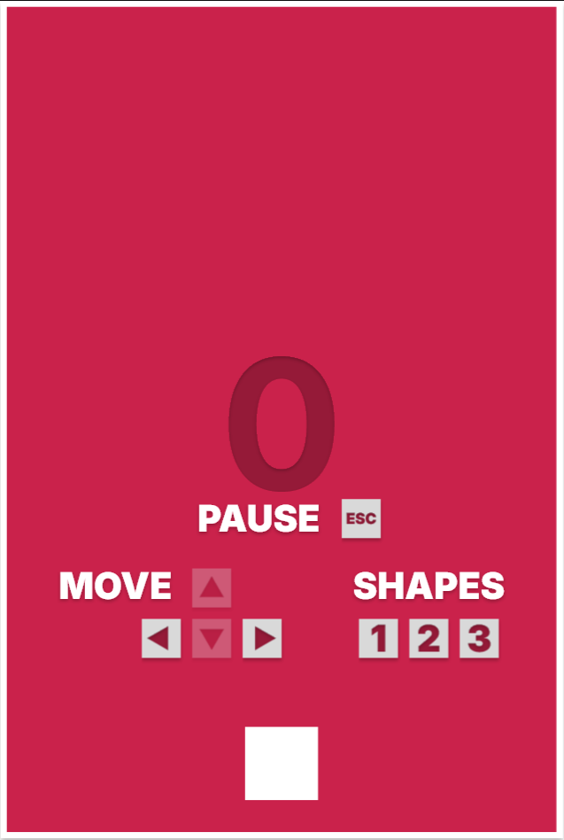
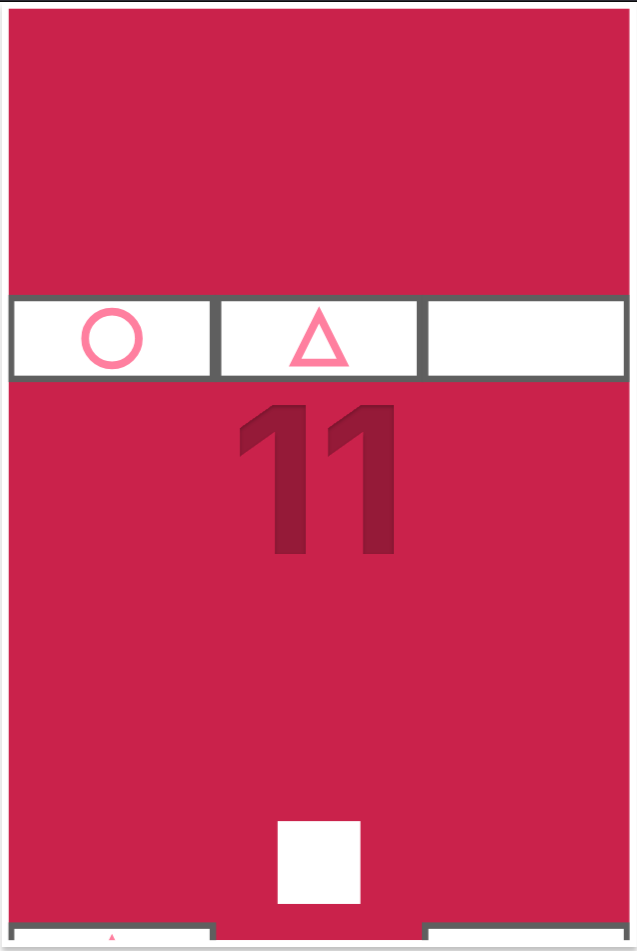
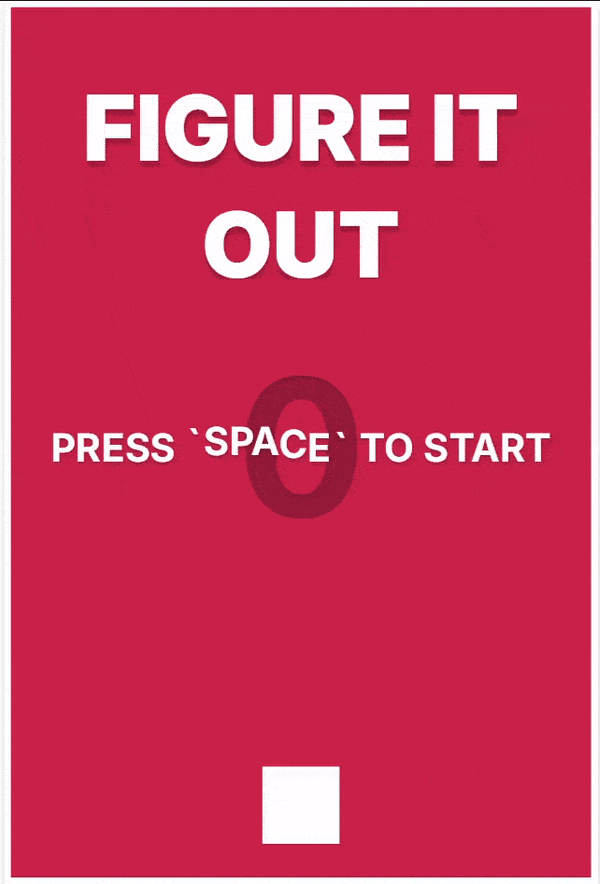

  

## 📌 Overview

**Figure It Out** is an arcade-style, fast-paced game where you control a shape-shifting player to break through the falling blocks. Your goal is to **survive as long as possible** while scoring points by aligning your shape with the **destructible blocks** and avoiding the **indestructible ones**.

This game **increases in difficulty** the longer you play, featuring multiple modes ranging from **Easy** to **Extreme**. With increasing speed, more frequent spawns, and a higher score threshold, the game keeps you on your toes as you aim for the ultimate score of **9999** to win! 🏆

## 📋 Table of Contents

- [🎮 Gameplay](#-gameplay)
- [📷 Screenshots](#-screenshots)
- [⌨️ Controls](#%EF%B8%8F-controls)
- [🎞️ GIF Demo](#%EF%B8%8F-gif-demo)
- [🕹️ Game Modes](#%EF%B8%8F-game-modes)
- [🎯 How to Play](#-how-to-play)
- [🎵 Audio](#-audio)
- [🛠️ Known Issues](#%EF%B8%8F-known-issues)
- [👥 Credits](#-credits)
- [📜 License](#-license)

## 🎮 Gameplay

The game features:
- 🔺 A **shape-shifting player** who can change between a **box**, **circle**, and **triangle**.
- 🔲 Falling blocks, some are **destructible** if you match the player’s shape, while others are **indestructible**.
- ⏳ Increasing game difficulty based on your **score**, with faster block spawning and movement.

Your objective is to:
1. 🛡️ **Survive** by destroying destructible falling blocks.
2. 🎯 **Score points** by breaking through the falling blocks.
3. 🏆 Reach the **ultimate score of 9999** to win the game.

## 📷 Screenshots
Below are a few screenshots highlighting the core gameplay elements.

    

## ⌨️ Controls

- ⬅️➡️ **Arrow Left / Right**: Move the player left or right.
- 🔢 **1 / 2 / 3**: Change the player's shape (**1** = Box, **2** = Circle, **3** = Triangle).
- 🎮 **Spacebar**: Start the game from the title screen.
- ⏸️ **Escape**: Pause/Resume the game.
- 🔄 **CTRL + R**: Reset the game after it ends or while playing.

## 🎞️ GIF Demo

  

## 🕹️ Game Modes

The game difficulty automatically adjusts based on your score:

- 🟢 **Easy Mode (0-25 points)**: 
  - 🐢 Blocks move slowly.
  - ⏳ Blocks spawn every **3 seconds**.
  
- 🟡 **Medium Mode (25-100 points)**:
  - 🚀 Blocks move faster.
  - ⏱️ Blocks spawn every **1.8 seconds**.
  
- 🔴 **Hard Mode (100-300 points)**:
  - ⚡ Faster block speed.
  - ⏱️ Blocks spawn every **1.2 seconds**.

- 💀 **Extreme Mode (300+ points)**:
  - 💨 Maximum speed.
  - ⏱️ Blocks spawn every **1 second**.

## 🎯 How to Play

1. ▶️ **Start the Game**: Press the **Spacebar** on the start screen to begin.
2. 🔄 **Shape Shift**: Use keys 1️⃣, 2️⃣, or 3️⃣ to change your shape.
3. ⚔️ **Destroy or Dodge**: Align your shape with falling blocks to destroy them. If you collide with the wrong shape, the game ends.
4. 🏆 **Score & Win**: Each successfully destroyed block increases your score. Reach **9999** points to win the game.

## 🎵 Audio

🎼 Background music by **Tac0zzz1** from IndieGameMusic.  
🔗 You can find the music track [here](https://www.indiegamemusic.com/viewtrack.php?id=5207).

🎶 The game features **looping background music** to immerse you in the experience. 
 
🔊 Make sure your **sound is turned on** for the full gameplay effect.

## 🛠️ Known Issues

- ⚠️ Blocks may spawn **too close to each other** in higher difficulty modes, making it challenging to react in time.
- 🖥️ On some browsers, **pausing when the tab loses focus** might not work correctly.

## 👥 Credits

- 🎮 **Game Developer**: Marceli Antosik (Muppetsg2)
- 🎵 **Music**: Tac0zzz1

## 📜 License

📝 This game is licensed under the **GNU General Public License v3.0 (GPL-3.0)**.
 
✅ This license allows you to freely use, modify, and distribute the game, with the condition that any derivative works or distributions must also be licensed under the same terms.

📖 See the [LICENSE](./LICENSE) file for more details.