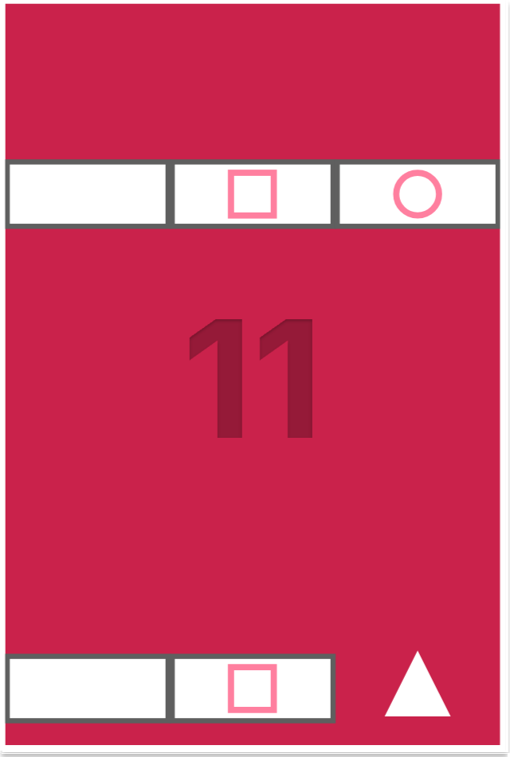

# Figure It Out

  

## Overview

**Figure It Out** is an arcade-style, fast-paced game where you control a shape-shifting player to break through the falling blocks. Your goal is to survive as long as possible while scoring points by aligning your shape with the destructible blocks and avoiding the indestructible ones.

This game increases in difficulty the longer you play, featuring multiple modes ranging from **easy** to **extreme**. With increasing speed, more frequent spawns, and a higher score threshold, the game keeps you on your toes as you aim for the ultimate score of **9999** to win!

## Table of Contents

- [Gameplay](#gameplay)
- [Controls](#controls)
- [Game Modes](#game-modes)
- [How to Play](#how-to-play)
- [Audio](#audio)
- [Known Issues](#known-issues)
- [Credits](#credits)
- [License](#license)

## Gameplay

The game features:
- A shape-shifting player who can change between a **box**, **circle**, and **triangle**.
- Falling blocks, some of which are destructible if you match the player’s shape, while others cannot be destroyed.
- Increasing game difficulty based on score, with faster block spawning and movement.

Your objective is to:
1. **Survive** by destroying destructible falling blocks.
2. **Score points** by through the falling blocks.
3. Reach the **ultimate score of 9999** to win the game.

### Screenshots
Below are a few screenshots highlighting the core gameplay elements.

    

## Controls

- **Arrow Left / Right**: Move the player left or right.
- **1 / 2 / 3**: Change the player's shape (1 = Box, 2 = Circle, 3 = Triangle).
- **Spacebar**: Start the game from the title screen.
- **Escape**: Pause/Resume the game.
- **CTRL + R**: Reset the game after it ends or while playing.

### GIF Demo

*A quick look at the action in Figure It Out.*

## Game Modes

The game difficulty automatically adjusts based on your score:

- **Easy Mode (0-25 points)**: 
  - Blocks move slowly.
  - Spawns every 3 seconds.
  
- **Medium Mode (25-100 points)**:
  - Blocks move faster.
  - Spawns every 1.8 seconds.
  
- **Hard Mode (100-300 points)**:
  - Faster block speed.
  - Spawns every 1.2 seconds.

- **Extreme Mode (300+ points)**:
  - Maximum speed.
  - Spawns every second.

## How to Play

1. **Start the Game**: Press the **Spacebar** on the start screen to begin.
2. **Shape Shift**: Use keys **1**, **2**, or **3** to change your shape.
3. **Destroy or Dodge**: Align your shape with falling blocks to destroy them. If you collide with the wrong shape, the game ends.
4. **Score & Win**: Each successfully destroyed block increases your score. Reach **9999** points to win the game.

## Audio

Background music by **Tac0zzz1** from IndieGameMusic.  
You can find the music track [here](https://www.indiegamemusic.com/viewtrack.php?id=5207).

The game features looping background music to immerse you in the experience. Make sure your sound is turned on for the full gameplay effect.

## Known Issues

- Occasionally, blocks may spawn too close to each other in higher difficulty modes.
- On some browsers, pausing when the tab loses focus might not work correctly.

## Credits

- **Game Developer**: Muppetsg2
- **Music**: Tac0zzz1
